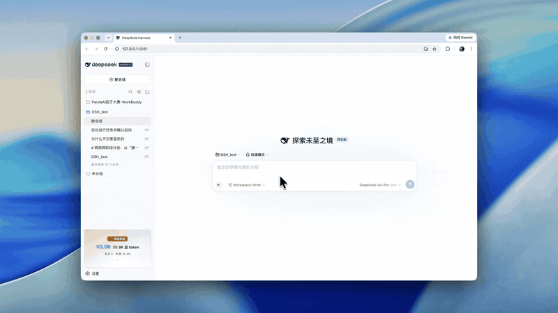

# dsh-board

[简体中文](README.md) · English

A **sidebar usage & cost dashboard** for [DeepSeek Harness (DSH)](https://github.com/deepseek-ai/deepseek-harness) — DeepSeek-backend-style usage stats in the bottom-left of your web GUI.



[](https://github.com/dfkai/dsh-board/releases)
[](./LICENSE)
[](https://github.com/deepseek-ai/deepseek-harness/discussions/2340)
[](https://github.com/dfkai/dsh-board/actions/workflows/ci.yml)

## Features

- **💰 Cost estimates** — official list prices plus automatic Beijing peak/off-peak switching from 2026-08-17 (peak 09:00–12:00 and 14:00–18:00, off-peak is half of peak); reasoning tokens billed at the output rate; see the billing notes below
- **🧠 1M context** — occupancy %, remaining budget, a system/tools/messages composition stack, and subagent time
- **📈 Charts** — per-turn input/output bars, cumulative output area, 12-week daily heatmap, per-model stats, all-sessions leaderboard
- **🏆 Word Guild ladder** — ten rungs of word-pun ranks (🌱 the Unawakened Sprout → 🧲 Wordlord → ⚡ Ten-Trillion Word God) as a membership card: progress bar, unlock ETA, per-tier perks
- **🔥 Achievements** — daily streak plus 9 data-driven badges
- **🎨 Design** — Geist-style restraint, light/dark themes, zh/en localization, zero decorative animation
- **🖼 Landscape badge** — collapsed it is a menu-width tile (rank tag + ¥ cost + total tokens + today/this week); clicking rides the badge to the top of the expanded panel, clicking again collapses it

## Install

```sh
dsh plugin --profile <profile> add github:dfkai/dsh-board@v0.1.0
```

Restart the profile (or start `dsh --profile <profile>` fresh) and the badge appears at the bottom of the left sidebar. Verify:

```sh
dsh --profile <profile> --dump-config   # should contain the # == dsh-board layer
```

> **Harness requirement**: counting reasoning tokens at the output rate needs the harness token-meter fix. The patch is posted in the official community ([discussions/2338](https://github.com/deepseek-ai/deepseek-harness/discussions/2338); merge-ready branch `dfkai/deepseek-harness@fix/token-meter-reasoning-output`). On older harnesses the per-turn/per-model charts still include reasoning, but lifetime totals and cost undercount it.

## Billing notes

The panel shows **estimates, not a billing statement** — the DeepSeek platform bill is authoritative.

**Standard prices** (¥ per 1M tokens, fetched 2026-08-15 from the [official price list](https://api-docs.deepseek.com/zh-cn/quick_start/pricing/)):

| Model | Cache hit | Cache miss | Output |
|---|---|---|---|
| deepseek-v4-pro | 0.025 | 3 | 6 |
| deepseek-v4-flash | 0.02 | 1 | 2 |
| deepseek-chat (legacy) | 0.5 | 2 | 8 |
| deepseek-reasoner (legacy) | 1 | 4 | 16 |

**Peak/off-peak** (effective 2026-08-17 00:00 Beijing time; peak 09:00–12:00 and 14:00–18:00, off-peak is half of peak):

| Model | Window | Cache hit | Cache miss | Output |
|---|---|---|---|---|
| deepseek-v4-pro | peak | 0.30 | 9.0 | 27 |
| | off-peak | 0.15 | 4.5 | 13.5 |
| deepseek-v4-flash | peak | 0.10 | 3.0 | 9 |
| | off-peak | 0.05 | 1.5 | 4.5 |

Notes:

- **Reasoning tokens are counted at the output rate** (DeepSeek's billing semantics); `reasoningTokens` is folded into output
- **This-session cost** uses the dominant model; **lifetime cost** prices each session at its last-activity moment with the default model (v4-pro)
- Unknown models fall back to the default model's rate in the table of the current moment

## Data & privacy

All data comes from the local DSH public seams (`session.list` projections + the `session.history` RPC). The plugin makes **no third-party network requests**; the only persistence is the panel collapsed state in browser localStorage.

## FAQ

**Why are total tokens in the billions?**

The accounting matches the DeepSeek backend: every turn re-prices the context prefix at the cache-hit rate. A 1M-window session reaches hundreds of millions of hit tokens after a few dozen turns — they are extremely cheap (¥0.025/M); the panel's "cache hit N%" figure separates the cheap reads from real spend.

**Is the cost accurate?**

It follows the official price list (peak/off-peak aware, reasoning included) but is not a billing statement. Lifetime cost uses the default model and each session's last-activity moment; the DeepSeek platform bill is authoritative.

**Does any data leave my machine?**

No. All statistics are computed locally with no outbound requests.

## Development

```sh
pnpm install
pnpm build                  # build lib/
pnpm sync -- <profile dir>  # sync into an installed copy, HMR hot-reloads
```

- `src/` changes: build → sync → browser hot-reloads. Only manifest changes (package.json / cordis.patch.yml) need a reinstall + restart.
- Headless verification (optional):

```sh
python3 -m playwright install chromium
python3 test/e2e.py                 # badge/panel mount + console error check
python3 test/drive-turn.py '...'    # drive a real turn and read panel values
```

## Architecture

Public seams only:

| Side | Contents |
|---|---|
| Host half `src/index.ts` | an empty-`apply` governed entry (same shape as official client plugins) |
| Browser half `src/client/*` | `ctx.slots.inject('sidebar.footer.action', …)` registers the badge; data = session-list store `projectionValues` + `session.history` RPC folding |
| Build `tsdown.config.ts` | CJS closure factory (`window.__ModuleLoader__.load`) + platform whitelist externals |

## License

[MIT](./LICENSE)
